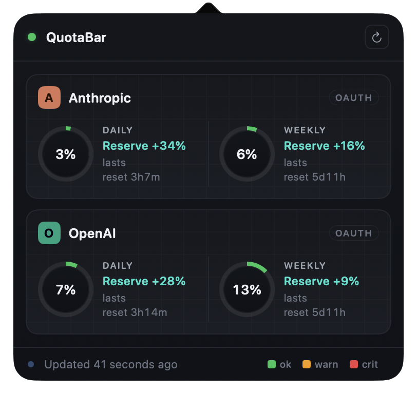

# QuotaBar

**Know exactly how much OpenAI and Anthropic budget you have left — right from your menu bar.**

No more opening two dashboards, squinting at reset timers, or guessing whether you can afford to run that one more agent. QuotaBar lives in your menu bar, reads your existing local OAuth sessions, and keeps a quiet eye on both providers at once.

<p align="center">
  
</p>

## What You Get

- **Daily usage** so you can pace yourself before the day is half over
- **Weekly usage** to see the real trend, not just today's spike
- **Reserve headroom** from OpenAI credits and Anthropic extra-usage remaining
- **Reset timing** so you know when the clock flips
- **Pace hints** based on the active window — am I on track or torching tokens?

All of it in a popover that opens in under a second and stays out of your way the rest of the day.

## Why It Stays Fast

The implementation is deliberately small:

- AppKit-led menu bar shell
- SwiftUI popover content
- cache-first startup path
- bounded background refresh every 5 minutes
- existing local OAuth session reuse instead of a custom auth flow

## Install

Download the latest signed and notarized DMG from the [Releases page](https://github.com/Jonathanm10/QuotaBar/releases/latest), open it, and drag `QuotaBar.app` to `/Applications`.

Releases are cut from `v*` git tags — pushing `vX.Y.Z` triggers the release workflow, which signs with Developer ID, notarizes via App Store Connect API key, staples, and uploads the DMG.

## Status

QuotaBar is early-stage but usable. The codebase is small, the tests are fast, and the project is open to focused contributions that keep the app lean.

This project is not affiliated with, endorsed by, or maintained by OpenAI or Anthropic. Provider names and logos remain the property of their respective owners.

## Platform And Tooling

- macOS 14 or newer
- Swift 6 toolchain
- Xcode 16 or newer recommended for local development

## How Auth Works

QuotaBar does not ask contributors to provision new app credentials.

- OpenAI usage is read from an existing local Codex/OpenAI OAuth session, currently sourced from `~/.codex/auth.json` and refreshed into the macOS keychain.
- Anthropic usage is read from the macOS keychain entry used by Claude Code.
- API key-only flows are intentionally out of scope for now.

If those local sessions do not exist, the app can still build and tests will still pass, but live refreshes will fail until valid local credentials are present.

## Local Data Handling

- Cached snapshots are stored under the current user's Application Support directory in `QuotaBar/snapshots.json`.
- Refreshed OAuth credentials are stored in the macOS keychain.
- The repo should never contain real tokens, auth exports, or provider responses copied from a live machine.

## Quick Start

```bash
swift build
swift test
swift run QuotaBar
```

## Package As An App

```bash
./Scripts/package_app.sh
open QuotaBar.app
```

## Development Notes

- `Daily` is derived locally from the current day's delta in each provider's weekly utilization and resets at local midnight.
- The provider-native short window is still fetched and kept as fallback metadata during refresh.
- Reserve is sourced from OpenAI credits balance and Anthropic extra-usage remaining when available.
- Each metric line exposes provenance such as `oauth` or `cache`.
- Tests are expected to stay network-free.

## Contributing

Start with [CONTRIBUTING.md](CONTRIBUTING.md).

High-signal contributions for this repo:
- bug fixes with regression tests
- UI polish that preserves the current lightweight menu bar model
- provider parsing hardening for schema drift
- documentation and contributor-experience improvements

Please avoid drive-by dependency additions or broad rewrites before discussing them in an issue.

## Security

Read [SECURITY.md](SECURITY.md) before reporting credential-handling bugs or token leaks.

## License

This project is released under the [MIT License](LICENSE).
